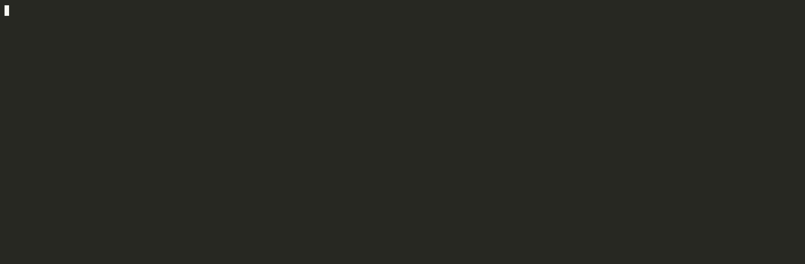

<div align="center">

# RiskKernel

**The risk engine for your AI agents.**

Deterministic cost / loop / time budgets · full observability · crash-resumable runs · human-approval gates · a memory you own.
Self-hosted. Your keys. No telemetry. Point it at your existing agents — one env var.

[](https://github.com/prashar32/riskkernel/actions/workflows/ci.yml)
[](https://github.com/prashar32/riskkernel/releases)
[](LICENSE)

<br/>



<sub><b>A runaway agent, stopped.</b> It loops over a codebase; the deterministic governor halts it at its loop budget with an HTTP&nbsp;402 — no model call escapes the cap. (<a href="examples/codebase-qa">runnable example</a>)</sub>

</div>

---

## The problem

Production AI agents fail in the same handful of ways, every time: **runaway loops**, **surprise token bills**, **no failure recovery**, **no observability**, **no human-in-the-loop**, **no governance**. Agent *frameworks* (LangGraph, CrewAI, AutoGen) orchestrate the reasoning — but none of them ship the guardrails that keep a run from burning $400 in a midnight loop while you sleep.

RiskKernel is a **self-hosted agent reliability runtime** — the deterministic, run-level layer that sits in front of your agents and enforces hard limits. The LLM proposes; deterministic Go code disposes. Every irreversible action is gated.

It is **not** another gateway (LiteLLM/Portkey own routing), **not** another observability dashboard (Langfuse/Phoenix own traces), and **not** a content-guardrails engine (Guardrails AI/NeMo own PII/jailbreak). It interoperates with all of those and competes on the one thing nobody ships in a single self-hosted binary: **deterministic run controls** — the agent SRE layer.

## What it does

| Capability | What it means |
|---|---|
| 💸 **Hard cost ceiling per run** | A run that hits its dollar/token budget is killed cleanly, state persisted. Safe defaults out of the box ([the budget contract](docs/BUDGETS.md)). |
| 🔁 **Hard loop-iteration cap** | No more infinite agent loops. |
| ⏱️ **Hard wall-clock budget** | Runs that exceed their time budget halt. |
| 💾 **Crash-resumable checkpoints** | `kill -9` the daemon mid-run; it reloads with the budget already spent and resumes from the last checkpoint — without re-spending. [Guide](docs/RESUME.md) · [demo](examples/kill-9-resume). |
| ✋ **Framework-agnostic approval gates** | Side-effecting tool calls pause for human approval — CLI, local web, webhook, or **Slack**. |
| 📜 **Policy-as-code** | Reusable budget / tool-allowlist / approval bundles via `POST /v1/policies` or a reviewed `riskkernel.yaml`, dry-run against recorded runs ([the policy guide](docs/POLICY.md)). |
| 📊 **Spend attribution & compliance** | Roll cost up across runs by team/user/feature (`riskkernel audit summary --by metadata.team`), plus a tamper-evident OWASP / EU AI Act evidence export ([compliance](docs/COMPLIANCE.md)). |
| 🧠 **Memory you own** | Git-native markdown/YAML on your disk; episodic state in your SQLite (or opt-in Postgres for HA — [docs](docs/POSTGRES.md)). |
| 📡 **OpenTelemetry GenAI (both ways)** | Emits `gen_ai.*` spans to *your* backend (Grafana/SigNoz/Datadog/Langfuse) **and ingests** them, to meter apps it never proxied ([ingress](docs/OTLP_INGRESS.md)). |

## Three ways to adopt — pick the one that fits

1. **Proxy (zero code).** Set one env var: `OPENAI_BASE_URL=http://localhost:7070/v1` (or `ANTHROPIC_BASE_URL` for `/v1/messages`). Every call — streaming or not — is intercepted, budgeted, logged, checkpointed, and forwarded to the real provider with your key. Native providers: Anthropic, OpenAI, and Ollama (local).
2. **SDK (deep control).** `pip install riskkernel` (Python) or `npm install @riskkernel/sdk` (TypeScript), then governed runs, per-step loop/time budgets, checkpoints, and approval gates. Framework adapters for the Claude Agent SDK, OpenAI Agents SDK, LangChain, LlamaIndex, CrewAI, AutoGen, and PydanticAI (Python), and the Vercel AI SDK (TypeScript).
3. **OpenTelemetry (universal).** RiskKernel is an OTLP endpoint *and* emitter — ingest GenAI spans (`POST /v1/traces`) to meter apps already instrumented with OpenLLMetry / the OpenAI Agents SDK / the Vercel AI SDK, and export cost/halt/tool spans to the backend you already run.

## Quickstart (60 seconds)

> **No key, one command?** [`examples/quickstart-compose`](examples/quickstart-compose)
> is a `docker compose up` demo that hard-stops a runaway agent with no API key and
> no local setup — the fastest way to see the loop-killer.

Run the daemon with your key (nothing leaves your machine except calls to the
provider you choose). Unconfigured, every run gets a safe default budget —
$5 / 100 loops / 1 hour — so nothing is ever unbounded; here we set an explicit
50¢ cap (see [the budget contract](docs/BUDGETS.md)):

```bash
docker run --rm -p 7070:7070 -v "$PWD/data:/data" \
  -e ANTHROPIC_API_KEY=sk-ant-... \
  -e RISKKERNEL_DEFAULT_DOLLARS=0.50 \
  ghcr.io/prashar32/riskkernel:latest
```

Now put your **existing** OpenAI-compatible app under governance with **one env
var** — no code changes — and point it at a Claude model:

```bash
export OPENAI_BASE_URL=http://localhost:7070/v1
# your app runs unchanged; every call is metered, priced, budget-enforced
```

Or hit it directly and watch the governance headers:

```bash
curl -s -D- http://localhost:7070/v1/chat/completions \
  -H 'content-type: application/json' \
  -H 'X-RiskKernel-Run-Id: demo' \
  -d '{"model":"claude-sonnet-4-5","messages":[{"role":"user","content":"hi"}]}'
# → X-RiskKernel-Cost-Usd, X-RiskKernel-Tokens, X-RiskKernel-Step …
# the run is killed with HTTP 402 the moment it exceeds $0.50.
```

Inspect and audit, all on your disk:

```bash
riskkernel runs list                      # every governed run
riskkernel audit export <run-id>          # the cost ledger as JSON
riskkernel audit tools <run-id>           # governed tool calls as JSON
riskkernel audit summary --by metadata.team   # spend rolled up across runs
riskkernel audit compliance <run-id>      # OWASP / EU AI Act evidence export
```

Prefer a native binary to Docker? Install the CLI with one command — no clone
needed — and run it:

```bash
go install github.com/prashar32/riskkernel/cmd/riskkernel@latest
riskkernel init      # scaffold a .env + a runnable example in the current dir
riskkernel serve     # start the daemon (reads .env)
```

(or `make build` from a clone). Tab-complete the CLI in your shell:

```bash
riskkernel completion bash > /etc/bash_completion.d/riskkernel        # bash
riskkernel completion zsh  > "${fpath[1]}/_riskkernel"                # zsh
riskkernel completion fish > ~/.config/fish/completions/riskkernel.fish  # fish
```

Deeper control (loops, checkpoints, approval gates) is the SDK — Python or
TypeScript:

```bash
pip install riskkernel          # Python  → sdks/python
npm install @riskkernel/sdk     # TypeScript → sdks/typescript
```

See [`sdks/python`](sdks/python) and [`sdks/typescript`](sdks/typescript). Trace
every run in your own backend: [`examples/otel`](examples/otel).

Want to *see* the headline feature? [`examples/codebase-qa`](examples/codebase-qa)
is a runnable agent that loops over a codebase until the governor kills it on its
loop/dollar budget — the deterministic kill, end to end, with a real model.

And the moat: [`examples/kill-9-resume`](examples/kill-9-resume) `kill -9`s the
daemon mid-run and resumes without re-spending — `./demo.sh` scripts the whole
crash-and-recover and proves the counter doesn't double, key-free.

Brand new to the SDK? [`examples/wrap-your-agent`](examples/wrap-your-agent) is the
no-key, two-minute version — a generic Python loop the governor caps at a loop
budget, the deterministic kill with nothing running but the daemon.

On LangChain? [`examples/langchain`](examples/langchain) wraps a LangChain loop
with the callback handler and caps it at a loop budget — also key-free.

Governing tools over MCP? [`examples/mcp`](examples/mcp) puts the MCP gateway in
front of a stub server and shows a tool blocked by the allowlist, a side-effecting
tool held for approval, and the audit trail — key-free.

Hit a snag? `riskkernel doctor` diagnoses most setups, and the
[troubleshooting guide](docs/TROUBLESHOOTING.md) maps the common errors —
missing key, port in use, the expected 402 budget halt — to fixes.

## Design principles

- **Deterministic core in Go.** All enforcement (budgets, kill switches, gating, routing, retries, checkpointing) lives in compiled, statically-typed code — never in an LLM.
- **No telemetry, ever.** Nothing phones home. It's a verifiable promise; see [`SECURITY.md`](SECURITY.md).
- **Your keys, your infra.** Secrets come from env / `.env` / OS-keyring, never stored in state, never logged.
- **Near-zero adoption friction.** Every decision is judged by *"how few changes must an existing user make?"* One env var is the gold standard.
- **Backwards compatibility is sacred.** Self-hosted users can't be force-migrated. See [`COMPATIBILITY.md`](COMPATIBILITY.md).

## ⭐ If this is useful

RiskKernel is a one-person, build-in-public project. If the idea resonates — or you
just want runaway agents to stop quietly burning money — a star genuinely helps:
it's how other people find it, and it tells me which parts are worth building next.

And if you actually run it, I'd love to hear where the guardrails are too strict or
too loose — [open an issue](https://github.com/prashar32/riskkernel/issues). That
feedback shapes the roadmap directly.

## Contributing

Contributions are welcome. Start with [`ARCHITECTURE.md`](ARCHITECTURE.md) for a
map of the codebase (and a "where do I code?" table), then
[`CONTRIBUTING.md`](CONTRIBUTING.md) for dev setup and the PR flow. We use GitHub
Flow — fork, branch off `main`, open a PR; CI (`build & test` + `CodeQL`) and a
maintainer review gate every merge.

Good places to start: issues tagged [`good first issue`](https://github.com/prashar32/riskkernel/labels/good%20first%20issue).
Be excellent to each other — see the [Code of Conduct](CODE_OF_CONDUCT.md).

## License

[Apache-2.0](LICENSE). The runtime stays permissive, forever.
